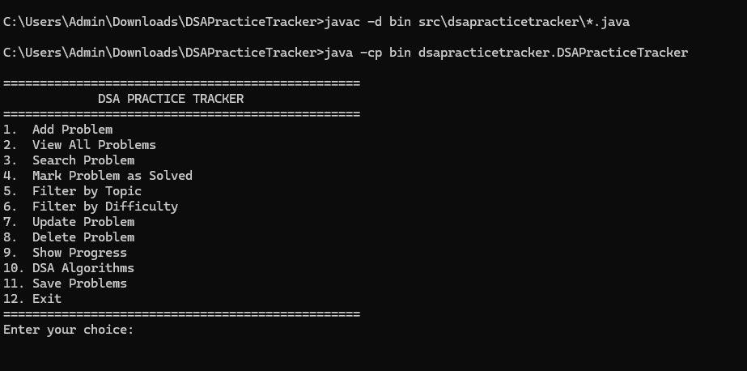

# DSA Practice Tracker

A Java-based console application for practicing and managing
Data Structures and Algorithms problems.

## 🖥️ Application Demo



## 📌 Project Overview

DSA Practice Tracker allows users to maintain a list of DSA problems,
track their solving status, search problems, filter them by topic or
difficulty, and monitor overall progress.

The project is developed using Core Java and focuses on implementing
Data Structures and Algorithms from scratch.

## ✨ Features

- Add a new DSA problem
- View all problems
- Search problem by ID
- Search problem by name
- Mark a problem as solved
- Filter problems by topic
- Filter problems by difficulty
- Update problem details
- Delete problem
- Show solving progress
- Practice DSA algorithms
- Save problems

## 🧠 DSA Topics

### Arrays

- Array Operations
- Linear Search
- Binary Search

### Sorting

- Bubble Sort
- Selection Sort
- Insertion Sort
- Merge Sort
- Quick Sort
- Heap Sort

### Stack

- Stack using Array
- Stack using Linked List
- Reverse String
- Palindrome using Stack
- Balanced Brackets
- Infix to Postfix
- Postfix Evaluation

### Queue

- Queue using Array
- Circular Queue
- Queue using Linked List

### Linked List

- Singly Linked List
- Doubly Linked List
- Circular Linked List

### Trees

- Binary Tree
- Binary Search Tree

### Other

- Graph
- DSA Problem Tracking

## 🛠️ Technologies Used

- Java
- Object-Oriented Programming
- Data Structures
- Algorithms
- Git
- GitHub

## 📂 Project Structure

```text
DSAPracticeTracker/
│
├── src/
│   ├── module-info.java
│   │
│   └── dsapracticetracker/
│       ├── ArrayOperations.java
│       ├── BalancedBrackets.java
│       ├── BinarySearch.java
│       ├── BinarySearchTree.java
│       ├── BinaryTree.java
│       ├── BubbleSort.java
│       ├── CircularLinkedList.java
│       ├── CircularQueue.java
│       ├── DoublyLinkedList.java
│       ├── Graph.java
│       ├── HeapSort.java
│       ├── InfixToPostfix.java
│       ├── InsertionSort.java
│       ├── LinearSearch.java
│       ├── LinkedListOperations.java
│       ├── MergeSort.java
│       ├── PalindromeUsingStack.java
│       ├── PostfixEvaluation.java
│       ├── Problem.java
│       ├── QuickSort.java
│       ├── QueueArray.java
│       ├── QueueUsingLinkedList.java
│       ├── ReverseStringUsingStack.java
│       ├── SelectionSort.java
│       ├── StackUsingArray.java
│       ├── StackUsingLinkedList.java
│       └── DSAPracticeTracker.java
│
├── screenshot.png
├── .gitignore
└── README.md